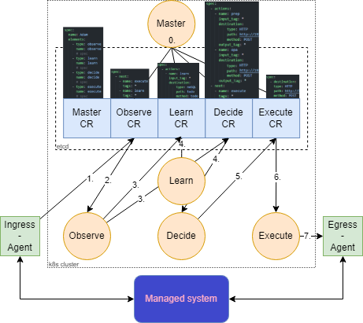
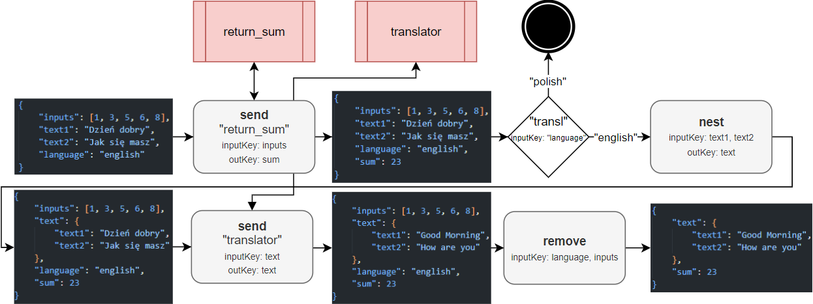
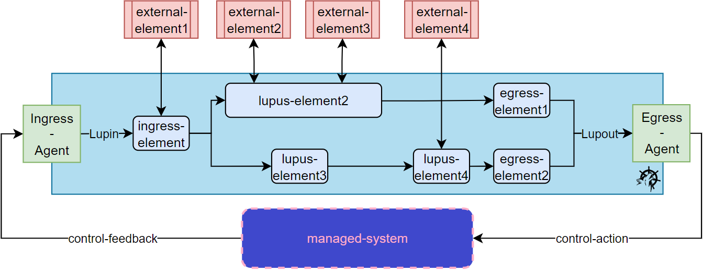

# Plan ogólny
### 1. Slajd tytułowy
- Tytuł pracy
- Imię i nazwisko autora
- Imię i nazwisko promotora
- Nazwa uczelni, wydział, kierunek studiów
- Data obrony
### 2. Wprowadzenie (Cel i motywacja pracy)
- Wyjaśnienie genezy podjęcia tematu, krótki wstęp rozwoju świata w danym kierunku
- Zarys luki badawczej
- Określenie celu pracy
### 3. Przegląd literatury
- Dotychczasowe odkrycia prace w tematyce pracy (Jak w rozdz.2)
- Krótka charakterystyka tego co jest teraz
- Podkreślenie, co praca wnosi nowego do tematu
### 4. Realizacja projektu
- Opis zastosowanych narzędzi
- Krótki opis procesu realizacji
### 5. Opis rozwiązania
- Opis architektury
- Przykład użytkowania
### 6. Efekty projektu
- Najważniejsze uzyskane wyniki
- Ocena skuteczności i funkcjonalności stworzonego rozwiązania
### 7. Wnioski i podsumowanie
- Najważniejsze osiągnięcia pracy
- Możliwości dalszego rozwoju
### 8. Slajd końcowy
- Zdanie zachęcające do zadawania pytań

# Plan szczegółowy (informacje przekazywane podczas wyświetlania danego slajdu)
## 1. Modelowanie złożonych pętli sterowania w środowisku Kubernetes 
- Tytuł: Modelowanie złożonych pętli sterowania w środowisku Kubernetes
- Autor: Andrzej Gawor
- Opiekun pracy: dr. inż. Dariusz Bursztynowski
- Politechnika Warszawska, Wydział Elektroniki i Technik Informacyjnych, Teleinformatyka i cyberbezpieczeństwo
- 27.02.2025
## 2. Wprowadzenie
- Treść sekcji 1.1: Obserwacja wzrostu skomplikowania sieci, enablers w postaci AI/ML oraz SDN/NFV, autonomiczne sieci, prace ETSI ZSM oraz ENI, zamknięte pętle sterowania jako centralny punkt konceptu, brak platformy do modelowania oraz wdrażania zamkniętych pętli sterowania
- Treść sekcji 1.2: Zaproponowanie architektury platformy, za pomocą której możliwe jest modelowanie, uruchamianie oraz zarządzanie pętlami sterowania, która może stanowić jako podstawa do implementacji jednego z modułów Kognitywnych i Autonomicznych Systemów Zarządzania Siecią specyfikowanych przez ETSI.
## 3. Przegląd literatury
- Treść rozdziału 2
- Rysunek 2.2 "Zestawienie lini czasu rozwoju systemów zarządzania siecią oraz pętli sterowania", komentarz: systemy telco są słabo określonymi stochastycznymi systemami, co opóźniło zastosowanie zamkniętych pętli sterowania
- Cytat z [6]: "Dotychczasowe rozwiązania są zbyt pragmatyczne i sztywne, skupione na wdrożeniu danej funkcjonalności"
- Przykładowo ONAP/CLAMP narzuca określoną architekturę pętli (MAPE-K) oraz współpraca jedynie w zakresie ONAP (w tym wybrane silniki polityk)
- Architektury ETSI ZSM oraz CLADRA opierają się na uruchamianiu wielu równoległych zamkniętych pętli sterowania, które orkiestrują pracą serwisów zarządzania
- To co praca wnosi nowego do tematu to elastyczność, której brakuje w ONAP oraz model kompatybilny z architekturami ETSI
## 4. Realizacja projektu
- Na podstawie przeglądu literatury zdefiniowano wymagania na platformę, co doprowadziło do wyboru Kubernetes jako środowiska uruchomieniowego.
- Następnie przy pomocy framework Kubebuilder rozwijano PoC opierające się na mechanizmach rozszerzeń Kubernetes (jak Custom Resources czy Operator Pattern) mające na celu walidacje opracowywanych koncepcji
## 5. Opis rozwiązania
- Schemat komunikacji między elementami pętli. Rysunek 4.4:

- Workflow akcji w obrębie pojedynczego elementu. Rysunek 3.5:
 
- Logiczne workflow elementów pętli. Rysunek 3.4:

- Krótka instrukcja użytkowania: wyrażanie pętli w notacji LupN

## 6. Efekty projektu
- Co uzyskano? 
> Platforma, bazując na wbudowanych mechanizmach warstwy sterowania Kubernetes, umożliwia użytkownikowi modelowanie złożonych scenariuszy sterowania w formie pętli. Logika bloków funkcjonalnych zawartych w scenariuszach może być wyniesiona do specjalizowanych aplikacji. Platforma integruje te bloki w spójny przepływ pracy (ang. *workflow*), jednocześnie umożliwiając modularność pętli - horyzontalnie, poprzez mechanizmy zasobów własnych (ang. *Custom Resources*) i komunikacji między nimi (modyfikacje atrybutów i rekoncyliacja operatorów) oraz wertykalnie, dzięki wprowadzonym mechanizmom komunikacji i przetwarzania, realizowanym za pomocą opracowanej składni.  W tym też kontekście niniejsza praca nie koncentruje się na aspektach związanych ze sztuczną inteligencją. Opracowana platforma ma służyć do modelowania, uruchamiania i zarządzania przepływem pracy (ang. *workflow*) w złożonych pętlach sterowania, ale sama nie stanowi środowiska wykonawczego dla jej zaawansowanych komponentów (np. silników polityk czy narzędzi AI/ML).
- Wykonano test przy użyciu emulatora 5G złożonego z Open5GS oraz UERANSIM.
## 7. Podsumowanie
- Główne osiągnięcia pracy:
    - Opracowanie koncepcji modelowania zamkniętych pętli sterowania jako zbioru zasobów Kubernetes
    - Opracowanie koncepcji wykorzystania atrybutów zasobów Kubernetes jako kanału komunikacji między elementami pętli
    - Opracowanie koncepcji realizacji logiki elementów pętli za pomocą operatorów Kubernetes
    - Opracowanie koncepcji delegowania złożonych operacji zarządzania do aplikacji wewnętrznych i model współpracy elementów pętli z takimi aplikacjami
    - Opracowanie notacji (języka) opisującej działanie elementów pętli w tym zarządzanie danymi oraz delegowanie złożonych operacji
- Kierunki rozwoju:
    - Integracja z silnikami AI lub innymi silnikami polityk niż Open Policy Agent
    - Wprowadzenie interfejsu graficznego pozwalającego symbolicznie definiować pętle
    - Dalszy rozwój komunikacji między elementami pętli poprzez wykorzystanie zasobów własnych 

## 8. Slajd końcowy
- Powtórzenie slajdu tytułowego lub zdanie zachęcające do zadawania pytań
