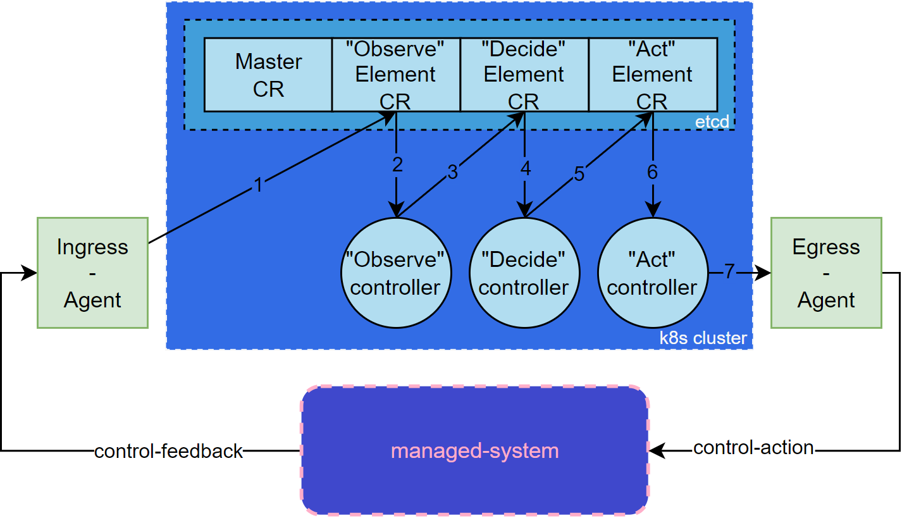

# Plan ogólny
### 1. Slajd tytułowy
- Tytuł pracy
- Imię i nazwisko autora
- Imię i nazwisko promotora
- Nazwa uczelni, wydział, kierunek studiów
- Data obrony
### 2. Wprowadzenie (Cel i motywacja pracy)
- Wyjaśnienie genezy podjęcia tematu, krótki wstęp rozwoju świata w danym kierunku
- Zarys luki badawczej
- Określenie celu pracy
### 3. Przegląd literatury
- Dotychczasowe odkrycia prace w tematyce pracy (Jak w rozdz.2)
- Krótka charakterystyka tego co jest teraz
- Podkreślenie, co praca wnosi nowego do tematu
### 4. Realizacja projektu
- Opis zastosowanych narzędzi
- Krótki opis procesu realizacji
### 5. Opis rozwiązania
- Opis architektury
- Przykład użytkowania
### 6. Efekty projektu
- Najważniejsze uzyskane wyniki
- Ocena skuteczności i funkcjonalności stworzonego rozwiązania
### 7. Wnioski i podsumowanie
- Najważniejsze osiągnięcia pracy
- Możliwości dalszego rozwoju
### 8. Slajd końcowy
- Zdanie zachęcające do zadawania pytań

# Plan szczegółowy (informacje przekazywane podczas wyświetlania danego slajdu)
## 1. Modelowanie złożonych pętli sterowania w środowisku Kubernetes 
- Tytuł: Modelowanie złożonych pętli sterowania w środowisku Kubernetes
- Autor: Andrzej Gawor
- Opiekun pracy: dr. inż. Dariusz Bursztynowski
- Politechnika Warszawska, Wydział Elektroniki i Technik Informacyjnych, Teleinformatyka i cyberbezpieczeństwo
- 27.02.2025
## 2. Wprowadzenie
Obserwujemy nieustanny wzrost skomplikowania sieci telekomunikacyjnych przez co coraz ciężej manualnie nimi operować. Pojawienie się takich technologii jak wirtualizacja i programowalność sieci oraz rozwoj sztucznej inteligencji stanowią solidną podstawę do tego, aby w telekomunikacji pojawiły się w pełni autonomiczne systemy zarządzania sieciami oparte o AI. Dwa komitety ETSI (Zero Touch Network and Service Management) oraz Experiential Networked Intelligence pracują nad specyfikacjami w tym kierunku. Punktem centralnym takich systemów są tytułowe pętle sterowania. 

Celem pracy jest opracowanie platformy, która umożliwia modelowani, uruchamiania oraz zarządzanie złożonymi pętlami sterowania. 
## 3. Przegląd literatury

Pracę rozpoczęto od przeglądu literatury. 

Ogólnie zamknięte pętle sterowania są już dosyć dobrze znane ludzkość w innych branżach, jednakże ze względu na to, że systemy telekomunikacyjne są słabo określonymi stochastycznymi systemami dopiero wkraczają do tej branży.

Od momentu pojawienia się SDN czy NFV w latach 2010 obserwujemy zastosowanie zamkniętych pęli sterowania na rynku, jednakże są to często implementacje określone tylko na jeden specyficzny problem i ciężko przenieść je na inne przypadki. W systemie zarządzania sieciami ONAP (Open Network Automation Platform) istnieje komponent CLAMP (Closed Loop Automation Management Platform), który umożliwia tworzenie zamkniętych pętli sterowania jednakże tam narzucona jest konkretna architektura pęli (tzw. MAPE-K) oraz okrojony jest wybór komponentów do współpracy. Kluczowym znaleziskiem jest również fakt, iż specyfikowane przez ETSI oraz CLADRA architektury opierają się o wiele działających równolegle pętlach sterowania, które orkiestrują pracą różnych serwisów zarządzania.

W związku z tym w pracy zdefiniowano lukę badawczą w postaci braku platformy, które umożliwia modelowanie i uruchamianie zamkniętych pętli sterowania w dodatku nie narzuca żadnej architektury pęli oraz żadnych komponentów współpracy oraz dodatkowo jest kompatybilna z modelem świeżo specyfikowanych architektur ETSI czy CLADRA.

## 3. Wymagania oraz założenia

Bezpośrednio z literatury zdefiniowano trzy wymagania wejściowe. Platforma ma pozwalać modelować pętle w ustandaryzowany sposób, musi potrafić integrować pętle ze środowiskiem zewnętrznym poza platformę oraz pozwalać zarządzać cyklem życia pętli sterowania.

Następnie w drodze badań formułowano wymagania szczegółowe dotyczące po pierwsze samych elementów pętli oraz po drugie środowiska wykonawczego, tak aby nie pisać platformy od zera.

Wymagania na elementy wywiedziono z ponownej analizy literatury z dokumentów, które omawiają znane już ludzkości architektury pętli sterowania, za cel platformy postawiono możliwość ich realizacji. 

## 4. Realizacja projektu

Z racji wymagań 1-3 oraz 16 jako środowisko wykonawcze wybrano Kubernetes.
Wyrażenie elementów pętli jako zasobów Kubernetes pozwala spełnić wymagania 4 oraz 6. 

Dalsze prace nad projektem skupiły się na opracowaniu operatora oraz specyfikacji takiego zasobu. 

Zgodnie z wymaganiami 11, 12 i 13 opracowano notację (język) umożliwiającą wyrażanie logiki elementów pętli, w tym: workflow decyzyjnych (wymaganie 9) opartych na danych (wymaganie 10) oraz delegowania złożonych obliczeń na zewnątrz (wymaganie 7). 

Dodatkowo wyspecyfikowano interfejsy umożliwiające komunikację elementów pętli ze środowiskiem zewnętrznym.

> Możliwe, że ten "slajd" graficznie będzie składał się z np. dwóch. Tekst zostanie okrojony, ten dokument specyfikuje informacje przekazywane podczas prezentacji na danym slajdzie, nie jego treść.

## 5. Opis rozwiązania
- Schemat komunikacji między elementami pętli. Rysunek 4.4:

- Workflow akcji w obrębie pojedynczego elementu. Rysunek 3.5:
 
- Wyrażanie logiki pętli w notacji LupN
// Tu jakiś screen z notacją
- Krótka instrukcja użytkowania -> wypisane kroki jakie należy podjąć

## 6. Efekty projektu
- Co uzyskano? 
> Platforma, bazując na wbudowanych mechanizmach warstwy sterowania Kubernetes, umożliwia użytkownikowi modelowanie złożonych scenariuszy sterowania w formie pętli. Logika bloków funkcjonalnych zawartych w scenariuszach może być wyniesiona do specjalizowanych aplikacji. Platforma integruje te bloki w spójny przepływ pracy (ang. *workflow*), jednocześnie umożliwiając modularność pętli - horyzontalnie, poprzez mechanizmy zasobów własnych (ang. *Custom Resources*) i komunikacji między nimi (modyfikacje atrybutów i rekoncyliacja operatorów) oraz wertykalnie, dzięki wprowadzonym mechanizmom komunikacji i przetwarzania, realizowanym za pomocą opracowanej składni.  W tym też kontekście niniejsza praca nie koncentruje się na aspektach związanych ze sztuczną inteligencją. Opracowana platforma ma służyć do modelowania, uruchamiania i zarządzania przepływem pracy (ang. *workflow*) w złożonych pętlach sterowania, ale sama nie stanowi środowiska wykonawczego dla jej zaawansowanych komponentów (np. silników polityk czy narzędzi AI/ML).
- Wykonano test przy użyciu emulatora 5G złożonego z Open5GS oraz UERANSIM.https://www.canva.com/design/DAFMhjC8sjY/bPWI_XifbD9yie0nFcpKWw/edit
// rysunki
## 7. Podsumowanie
- Główne osiągnięcia pracy:
    - Opracowanie koncepcji modelowania zamkniętych pętli sterowania jako zbioru zasobów Kubernetes
    - Opracowanie koncepcji wykorzystania atrybutów zasobów Kubernetes jako kanału komunikacji między elementami pętli
    - Opracowanie koncepcji realizacji logiki elementów pętli za pomocą operatorów Kubernetes
    - Opracowanie koncepcji delegowania złożonych operacji zarządzania do aplikacji wewnętrznych i model współpracy elementów pętli z takimi aplikacjami
    - Opracowanie notacji (języka) opisującej działanie elementów pętli (w tym zarządzanie danymi, zmiany przebiegu pojedynczych iteracji oraz delegowanie złożonych operacji)
- Kierunki rozwoju:
    - Integracja z silnikami AI lub innymi silnikami polityk niż Open Policy Agent
    - Wprowadzenie interfejsu graficznego pozwalającego symbolicznie definiować pętle
    - Dalszy rozwój komunikacji między elementami pętli poprzez wykorzystanie zasobów własnych 

## 8. Slajd końcowy
- Powtórzenie slajdu tytułowego lub zdanie zachęcające do zadawania pytań